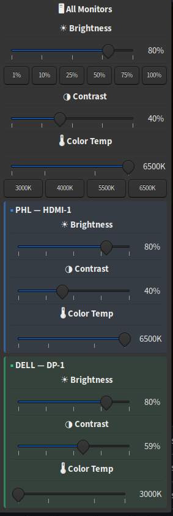

# ddc-slider 

_12 languages covering._

## [fork of xfce4-ddc-brightness-slider](https://github.com/krsnv/xfce4-ddc-brightness-slider)

    Disclaimer: I changed the name to `ddc-slider` 
    because the script uses `ddcutil` backend instead of `ddccontrol` _(not maintained anymore)._

GTK3 system tray applet that controls external monitor brightness and contrast via [DDC/CI](https://en.wikipedia.org/wiki/Display_Data_Channel) protocol.

Works with any desktop environment or window manager that has a system tray (tint2, xfce4-panel, polybar, etc).



## Features

- **Per-monitor control** — individual brightness and contrast sliders for each DDC-capable monitor, plus a master slider for all at once
- **Proper monitor names** — shows model names (e.g. "Dell P2414H") from EDID, not generic "VESA monitor"
- **Instant startup** — state cache remembers monitors and last-used values; window appears immediately, hardware refresh runs in background
- **Tray icon** — left-click opens popup, scroll wheel adjusts brightness, right-click for presets, refresh, redshift toggle
- **Refresh monitors** — re-detect monitor hardware and clear state cache from right-click menu
- **Standalone mode** — floating window as an alternative to the tray (`--standalone`)
- **Color temperature** — preset buttons (3000K–6500K) via redshift
- **Configurable presets** — define brightness/contrast/color_temp combos in a JSON config
- **Light & dark icons** — embedded SVG tray icons with auto-detection or manual override (`--icon light|dark`)
- **Lightweight** — single Python file, no build step, no pip packages

## Requirements

- Linux with an external monitor that supports DDC/CI
- [ddcutil](https://www.ddcutil.com/)
- Python 3.10+
- GTK 3 (`python3-gi`, `gir1.2-gtk-3.0`)
- redshift (optional, for color temperature)
- User must be in the `i2c` group

## Installation

### Quick install (recommended)

```bash
git clone https://github.com/musduz/ddc-slider.git
cd ddc-slider
chmod +x install.sh
./install.sh
```

The installer handles dependencies, I2C permissions, man page, and autostart.

#### Custom prefix (no sudo needed)

```bash
./install.sh --prefix ~/.local
```

### Manual install — Arch Linux / Mabox / Manjaro

```bash
sudo pacman -S ddcutil python-gobject gtk3

# Load i2c-dev module
sudo modprobe i2c-dev
echo "i2c-dev" | sudo tee /etc/modules-load.d/i2c-dev.conf

# I2C permissions
sudo groupadd -f i2c
sudo usermod -aG i2c $USER
echo 'KERNEL=="i2c-[0-9]*", GROUP="i2c", MODE="0660"' | sudo tee /etc/udev/rules.d/99-i2c.rules
sudo udevadm control --reload-rules && sudo udevadm trigger

# Install
sudo cp ddc-slider.py /usr/local/bin/ddc-slider
sudo chmod 755 /usr/local/bin/ddc-slider
sudo cp ddc-slider.1 /usr/local/share/man/man1/
sudo chmod 644 /usr/local/share/man/man1/ddc-slider.1
sudo cp release.txt /usr/local/share/ddc-slider/release.txt
sudo chmod 644 /usr/local/share/ddc-slider/release.txt
```

Log out and back in for the `i2c` group to take effect.

### Manual install — Ubuntu / Debian

```bash
sudo apt install ddcutil python3-gi gir1.2-gtk-3.0

# Load i2c-dev module
sudo modprobe i2c-dev
echo "i2c-dev" | sudo tee /etc/modules-load.d/i2c-dev.conf

# I2C permissions
sudo groupadd -f i2c
sudo usermod -aG i2c $USER
echo 'KERNEL=="i2c-[0-9]*", GROUP="i2c", MODE="0660"' | sudo tee /etc/udev/rules.d/99-i2c.rules
sudo udevadm control --reload-rules && sudo udevadm trigger

# Install
sudo cp ddc-slider.py /usr/local/bin/ddc-slider
sudo chmod 755 /usr/local/bin/ddc-slider
sudo cp ddc-slider.1 /usr/local/share/man/man1/
sudo chmod 644 /usr/local/share/man/man1/ddc-slider.1
sudo cp release.txt /usr/local/share/ddc-slider/release.txt
sudo chmod 644 /usr/local/share/ddc-slider/release.txt
```

### Verify setup

```bash
# Check that ddcutil sees your monitors
ddcutil detect
```

## Usage

```bash
ddc-slider                     # Tray icon mode (default)
ddc-slider --standalone        # Floating window mode
ddc-slider --icon light        # White tray icon (for dark panels)
ddc-slider --icon dark         # Dark tray icon (for light panels)
ddc-slider --bus 3             # Use a specific I2C bus
ddc-slider --no-cache          # Force fresh hardware probe
ddc-slider --get               # Print current brightness and exit
ddc-slider --set 70            # Set brightness to 70 and exit
ddc-slider --get-contrast      # Print current contrast and exit
ddc-slider --set-contrast 50   # Set contrast to 50 and exit
```

### Tray icon controls

| Action | Effect |
|--------|--------|
| Left-click | Toggle brightness/contrast popup |
| Scroll wheel | Adjust brightness (all monitors) |
| Right-click | Presets, redshift toggle, quit |

See `man ddc-slider` for full documentation.

## Configuration

Config file: `~/.config/ddc-slider/config.json`

```json
{
  "scroll_step": 2,
  "presets": [
    {
      "name": "Movie",
      "brightness": 30,
      "contrast": 60,
      "color_temp": 3500
    },
    {
      "name": "Reading",
      "brightness": 80,
      "contrast": 40,
      "color_temp": 5500
    }
  ],
  "monitor_names": {
    "3": "Philips",
    "9": "Dell right"
  }
}
```

A default config is created on first run.

## Files

| Path | Description |
|------|-------------|
| `~/.config/ddc-slider/config.json` | Presets and scroll step |
| `~/.config/ddc-slider/state.json` | Cached monitor state (auto-managed) |
| `~/.config/ddc-slider/icons/` | SVG tray icons (auto-generated, replaceable) |

## Autostart (default)

To start ddc-slider on login, create `~/.config/autostart/ddc-slider.desktop`:

```ini
[Desktop Entry]
Type=Application
Name=DDC Slider
Exec=ddc-slider
Icon=display-brightness-symbolic
StartupNotify=false
X-GNOME-Autostart-enabled=true
```

## ddc-slider Launch  (To solve env)

To use ddc-slider with gmrun, rofi, or desktop application menus, first create the wrapper script:

```bash
sudo tee /usr/local/bin/ddc-slider-launch > /dev/null << 'EOF'
#!/bin/bash
ddc-slider > /tmp/ddc-slider.log 2>&1 &
exit 0
EOF
sudo chmod +x /usr/local/bin/ddc-slider-launch
```

Then create `~/.local/share/applications/ddc-slider.desktop`:

```ini
[Desktop Entry]
Version=1.0
Type=Application
Name=DDC Brightness & Contrast
Comment=Control monitor brightness and contrast via DDC/CI
Icon=display-brightness-symbolic
Exec=ddc-slider-launch
Terminal=false
Categories=Utility;Settings;
Keywords=brightness;contrast;monitor;ddc;
```

Now you can launch it from:
- **gmrun** (Alt+F2): Type "DDC" and press Enter
- **rofi**: Alt+F2, search "DDC Brightness"
- **Application menu**: Look for "DDC Brightness & Contrast"
- **Command line**: `ddc-slider` or `ddc-slider-launch`

The wrapper detaches cleanly and logs to `/tmp/ddc-slider.log`.

## Troubleshooting

**"Permission denied" on `/dev/i2c-*`**

```bash
# Check udev rule exists
cat /etc/udev/rules.d/99-i2c.rules
# Should contain: KERNEL=="i2c-[0-9]*", GROUP="i2c", MODE="0660"

# Check group membership
groups | grep i2c

# If missing, add and relog
sudo usermod -aG i2c $USER
```

**ddcutil can't find the monitor**

```bash
# Make sure i2c-dev is loaded
sudo modprobe i2c-dev

# Scan for monitors
ddcutil detect

# Check for "Invalid display" entries — those monitors don't support DDC/CI
```

**Tray icon invisible**

```bash
# Force white icon for dark panels
ddc-slider --icon light

# Force dark icon for light panels
ddc-slider --icon dark
```

## Uninstall

```bash
# Via install script
./install.sh --uninstall

# With custom prefix
./install.sh --uninstall --prefix ~/.local

# User config (optional, delete manually)
rm -rf ~/.config/ddc-slider
```

    Add i18n support with 12 languages

    Translated UI strings (brightness, contrast, tooltips, menus):
    - English (en)
    - Dutch (nl)
    - Polish (pl)
    - German (de)
    - Spanish (es)
    - French (fr)
    - Portuguese Brazilian (pt_BR)
    - Italian (it)
    - Russian (ru)
    - Turkish (tr)
    - Chinese Simplified (zh_CN)
    - Japanese (jp)

    Auto-detects from LC_MESSAGES/LANG, falls back to English.

## Credits

Original project: [xfce4-ddc-brightness-slider](https://github.com/krsnv/xfce4-ddc-brightness-slider) by Vladimir Krasnov (MIT License)

Fork/rewrite by Musduz, 2026-04-05 — switched to ddcutil backend, added per-monitor controls, state cache, and tray icon variants.

## License

MIT

NOTE:

- ddccontrol: Last release 0.1.3 (2005), no longer in most distros. No longer maintained.
https://www.ddcutil.com/ddccontrol/
- ddcutil: Actively maintained, modern codebase, in all major distros
- ddcutil author: Sanford Rockowitz (active development 2024+)
